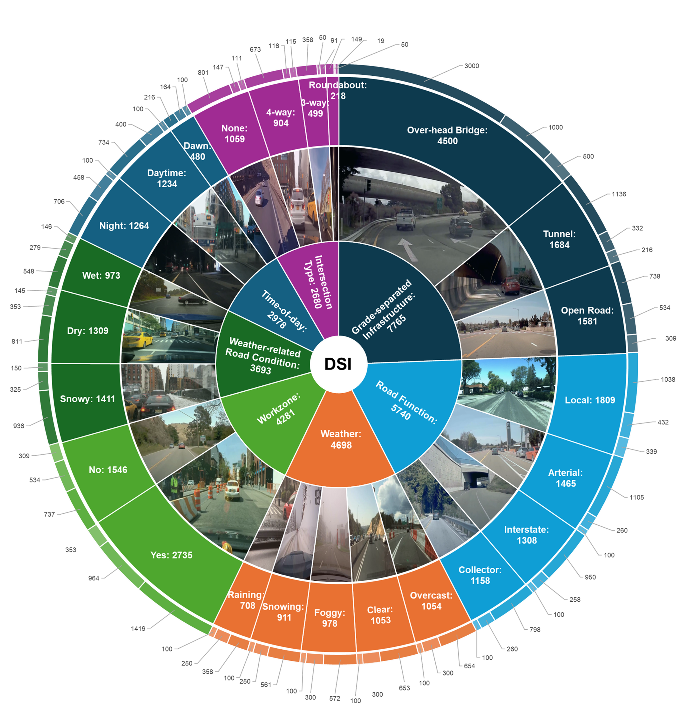

# KAA-CAL
# Driving Scene Identification (DSI) Dataset
## Overview

  

## Dataset Structure

Grade-separated Infrastructure (Trn: 4,874; Vld: 1,866; Tst: 1,025)

| Class             | Trn   | Vld   | Tst |
|-------------------|-------|-------|-----|
| Over-head Bridge  | 3,000 | 1,000 | 500 |
| Tunnel            | 1,136 | 332   | 216 |
| Open Road         | 738   | 534   | 309 |

Road Function (Trn: 3,891; Vld: 1,210; Tst: 639)

| Class        | Trn   | Vld  | Tst |
|--------------|-------|------|-----|
| Local        | 1,038 | 432  | 339 |
| Arterial     | 1,105 | 260  | 100 |
| Interstate   | 950   | 258  | 100 |
| Collector    | 798   | 260  | 100 |

Weather (Trn: 2,798; Vld: 1,400; Tst: 500)

| Class    | Trn   | Vld  | Tst |
|----------|-------|------|-----|
| Overcast | 654   | 300  | 100 |
| Clear    | 653   | 300  | 100 |
| Foggy    | 572   | 300  | 100 |
| Snowing  | 561   | 250  | 100 |
| Raining  | 358   | 250  | 100 |

Workzone (Trn: 2,121; Vld: 1,498; Tst: 662)

| Class | Trn   | Vld  | Tst |
|-------|-------|------|-----|
| Yes   | 1,418 | 964  | 353 |
| No    | 703   | 534  | 309 |

Road Condition (Trn: 2,295; Vld: 957; Tst: 441)

| Class | Trn   | Vld  | Tst |
|-------|-------|------|-----|
| Snowy | 938   | 325  | 150 |
| Dry   | 811   | 353  | 145 |
| Wet   | 548   | 279  | 146 |

Time-of-day (Trn: 1,656; Vld: 1,022; Tst: 300)

| Class     | Trn   | Vld  | Tst |
|-----------|-------|------|-----|
| Night     | 708   | 485  | 100 |
| Daytime   | 734   | 400  | 100 |
| Dawn/Dusk | 216   | 164  | 100 |

Intersection Type (Trn: 1,981; Vld: 332; Tst: 367)

| Class       | Trn   | Vld  | Tst |
|-------------|-------|------|-----|
| None        | 801   | 147  | 111 |
| 4-way       | 673   | 116  | 115 |
| 3-way       | 358   | 50   | 91  |
| Roundabout  | 149   | 19   | 50  |

