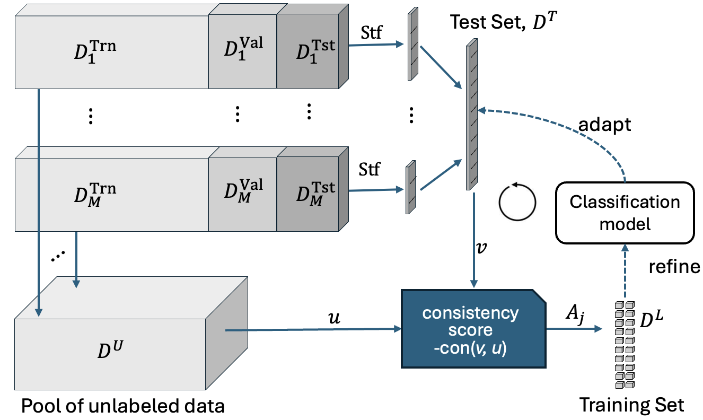
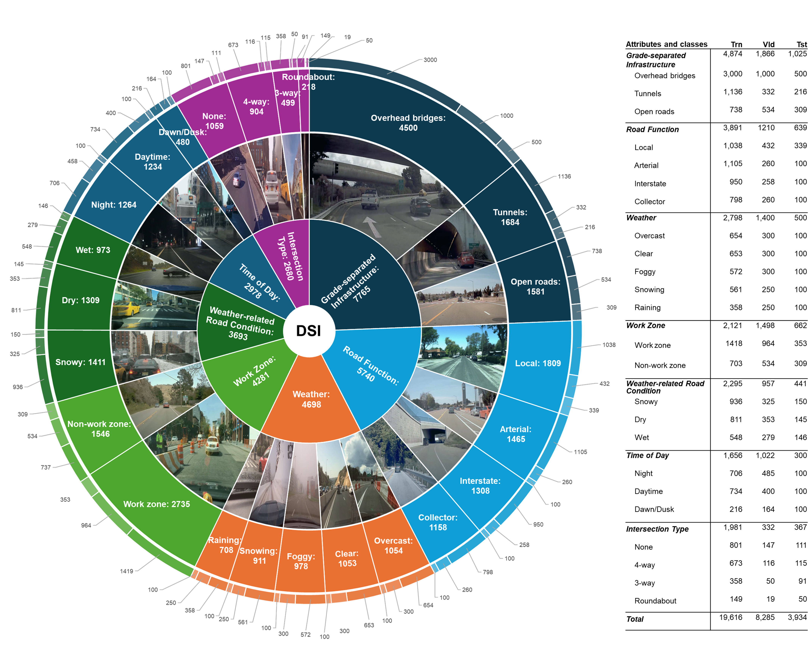

# KAA-CAL

## KAA
KAA **acquires** and **accumulates** knowledge about scene identification from various single-label datasets via monotask learning.
<p align="center">
  
</p>

## CAL
CAL effectively resolves the knowledge gap caused by the discrepancy between single-label and multi-label data.
<p align="center">
  
</p>

## 🚀 Release

We release the pretrained **KAA** model weights here: [Download](https://huggingface.co/Ke66668888/KAA/tree/main).

The remaining code will be released soon.

## 📊 Driving Scene Identification (DSI) Dataset

The **Driving Scene Identification (DSI)** dataset is a single-label dataset created to demonstrate our proposed approach to developing **KAA**, a multi-label scene classification model.

DSI consists of **31,835** scene images sampled from publicly available driving video datasets, including:

- [**BDD100K**](http://bdd-data.berkeley.edu.) — A large-scale and diverse driving dataset with videos and annotated images collected under various conditions.
- [**Honda HSD**](https://usa.honda-ri.com/HSD) — The Honda Driving Dataset, which contains annotated driving scenes for perception and classification tasks.
- [**ROADWork**](https://www.cs.cmu.edu/~roadwork/) — A dataset focusing on road scene understanding, including work zones and road functional classes.

We further supplement the dataset with additional driving scene images collected from YouTube videos.  
The dataset covers seven scene attributes: **Grade-separated Infrastructure**, **Road Function**, **Weather**, **Work Zone**, **Weather-related Road Condition**, **Time of Day**, and **Intersection Type**.  

In total, DSI provides image-level labels for **24 distinct classes**, with each class belonging exclusively to one of the seven attributes.

To support reproducibility, DSI follows a unified acquisition and annotation protocol. YouTube videos served only as supplementary sources for underrepresented attributes (Road Function, Weather-related Road Condition, and Intersection Type): dashboard ego-view driving videos were retrieved via class-specific queries and sampled every five frames. All images from BDD100K, HSD, ROADWork, and YouTube were re-annotated under a unified class-definition system rather than by adopting source-dataset labels. Each image was independently labeled by two domain experts, with disagreements resolved through discussion; unreliable labels were assigned a sentinel value of `-1` and excluded from the training loss.

## Overview
<p align="center">
  
</p>

## Dataset Structure

<details>
<summary>Grade-separated Infrastructure (Trn: 4,874; Vld: 1,866; Tst: 1,025)</summary>

| Class             | Trn   | Vld   | Tst |
|-------------------|-------|-------|-----|
| Overhead bridges  | 3,000 | 1,000 | 500 |
| Tunnels           | 1,136 | 332   | 216 |
| Open roads        | 738   | 534   | 309 |

</details>

<details>
<summary>Road Function (Trn: 3,891; Vld: 1,210; Tst: 639)</summary>

| Class        | Trn   | Vld  | Tst |
|--------------|-------|------|-----|
| Local        | 1,038 | 432  | 339 |
| Arterial     | 1,105 | 260  | 100 |
| Interstate   | 950   | 258  | 100 |
| Collector    | 798   | 260  | 100 |

</details>

<details>
<summary>Weather (Trn: 2,798; Vld: 1,400; Tst: 500)</summary>

| Class    | Trn   | Vld  | Tst |
|----------|-------|------|-----|
| Overcast | 654   | 300  | 100 |
| Clear    | 653   | 300  | 100 |
| Foggy    | 572   | 300  | 100 |
| Snowing  | 561   | 250  | 100 |
| Raining  | 358   | 250  | 100 |

</details>

<details>
<summary>Work Zone (Trn: 2,121; Vld: 1,498; Tst: 662)</summary>

| Class             | Trn   | Vld  | Tst |
|-------------------|-------|------|-----|
| Work zone         | 1,418 | 964  | 353 |
| None-work zone    | 703   | 534  | 309 |

</details>

<details>
<summary>Weather-related Road Condition (Trn: 2,295; Vld: 957; Tst: 441)</summary>

| Class | Trn   | Vld  | Tst |
|-------|-------|------|-----|
| Snowy | 938   | 325  | 150 |
| Dry   | 811   | 353  | 145 |
| Wet   | 548   | 279  | 146 |

</details>

<details>
<summary>Time of Day (Trn: 1,656; Vld: 1,022; Tst: 300)</summary>

| Class     | Trn   | Vld  | Tst |
|-----------|-------|------|-----|
| Night     | 708   | 485  | 100 |
| Daytime   | 734   | 400  | 100 |
| Dawn/Dusk | 216   | 164  | 100 |

</details>

<details>
<summary>Intersection Type (Trn: 1,981; Vld: 332; Tst: 367)</summary>

| Class       | Trn   | Vld  | Tst |
|-------------|-------|------|-----|
| None        | 801   | 147  | 111 |
| 4-way       | 673   | 116  | 115 |
| 3-way       | 358   | 50   | 91  |
| Roundabout  | 149   | 19   | 50  |

</details>

## Download url
The DSI dataset is avaliable and can be downloaded at this [url](https://drive.google.com/file/d/1yw4EcfGFGjs2OAa4sWfwQaIDkxDIAR46/view?usp=drive_link).

<pre markdown>
dataset/
├── train/
│   ├── Grade-separated Infrastructure/
│   │   ├── img001.jpg
│   │   ├── img002.jpg
│   │   └── …
│   ├── Road_Function/
│   │   ├── img001.jpg
│   │   ├── img002.jpg
│   │   └── …
│   ├── Weather/
│   │   └── …
│   ├── Work Zone/
│   │   └── …
│   ├── Road_Condition/
│   │   └── …
│   ├── Time of Day/
│   │   └── …
│   └── Intersection_Type/
│       └── …
├── val/
│   └── （same as train）
└── test/
    └── （same as train）
</pre>

# License notice

DSI dataset is ONLY free for non-commercial use, such as education and research use. 
# Citation

If you find our work helpful, please consider citing our paper:

**Multi-attribute Scene Classification for Autonomous Vehicles: Acquiring and Accumulating Knowledge from Diverse Datasets**  
Ke Li, Chenyu Zhang, Yuxin Ding, Xianbiao Hu, Ruwen Qin  
arXiv preprint, 2025  
👉 [https://arxiv.org/abs/2506.17101](https://arxiv.org/abs/2506.17101)

```bibtex
@misc{li2025multilabelsceneclassificationautonomous,
      title={Multi-label Scene Classification for Autonomous Vehicles: Acquiring and Accumulating Knowledge from Diverse Datasets}, 
      author={Ke Li and Chenyu Zhang and Yuxin Ding and Xianbiao Hu and Ruwen Qin},
      year={2025},
      eprint={2506.17101},
      archivePrefix={arXiv},
      primaryClass={cs.CV},
      url={https://arxiv.org/abs/2506.17101}, 
}
